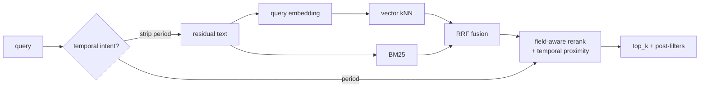

# Semantic search — design & distribution

Status: prototype (`proto/semantic-search`). Local-only hybrid search over GitHub
Security Advisories. No external engine or service; all inference on-device.

Companion docs: [`src/semantic/README.md`](../src/semantic/README.md) (how to run),
[`semantic-index-distribution.md`](semantic-index-distribution.md) (CI/portability deep-dive).

---

## 1. The tool: `semantic_search`

An MCP tool registered in `createAdvisoryServer()` (so it's on both the stdio and
HTTP servers), alongside `list_advisories` / `get_advisory`.

Input:

| field | type | notes |
|---|---|---|
| `query` | string (required) | natural language; may contain a period ("SSRF in August 2026", "recent RCE") |
| `top_k` | number | default 10, max 50 |
| `web_app_only` | bool | keep only web-app CWE classes |
| `severity` | enum | post-filter |
| `ecosystem` | enum | post-filter (mapped to OSV names) |
| `cwes` | string | comma-separated, bare or `CWE-` prefixed |

Output: JSON `{ query, count, index:{docs,model,db_commit}, results:[…] }` where each
result carries `ghsa_id, cve_id, summary, severity, published_at, cwes, packages,
ecosystems, score, temporal_relevance, url`. If the index isn't built, the tool
returns build instructions (non-fatal).

### Retrieval pipeline



1. **Temporal parse** — a period is lifted out of the query; recall runs on the
   *residual* text so date words don't pollute matching.
2. **Recall** — dense vector kNN (cosine over unit vectors) ∪ BM25 lexical.
3. **Fuse** — Reciprocal Rank Fusion (`k=60`).
4. **Rerank** — field-aware boosts (exact GHSA/CVE/package/CWE, summary phrase
   overlap) + temporal proximity to the requested period (in-window 1.0, exp
   decay, half-life 45 d). A local cross-encoder can replace the field reranker
   behind the same interface later.
5. **Post-filter** — `web_app_only` / `severity` / `ecosystem` / `cwes`, then `top_k`.

### Modules (`src/semantic/`)

| file | role |
|---|---|
| `document.ts` | Advisory → doc (embedded text + rerank fields + `published`) |
| `embeddings.ts` | Local ONNX embeddings (`@huggingface/transformers`, MiniLM 384-dim), offline |
| `bm25.ts` | Compact Okapi BM25, identifier-preserving tokenizer |
| `temporal.ts` | Parse period from query + publish-date proximity score |
| `store.ts` | Persist/load `embeddings.bin` + `bm25.json` + `docs.json` + `meta.json` |
| `hybrid.ts` | Recall → RRF → rerank |
| `build-index.ts` / `query.ts` | CLIs |
| `../tools/semantic-search.ts` | MCP tool wrapper |

---

## 2. Timing & size (measured)

Corpus: **35,514** `github-reviewed` advisories. Model: `Xenova/all-MiniLM-L6-v2`
(384-dim, fp32, CPU).

| Metric | Value |
|---|---|
| Full index build (local, CPU) | **1,335 s ≈ 22 min** (35,514 docs) |
| CI build step (2,000-doc test, incl. 35k DB scan + model download) | 118 s; total job **3.5 min** |
| Extrapolated full build on `ubuntu-latest` (4 vCPU) | **~25–40 min** (well within a 2 h budget) |
| Query latency (35k, brute-force cosine + BM25 + rerank) | sub-second |
| `embeddings.bin` | **52.0 MB** (`35,514 × 384 × 4`) |
| `bm25.json` | 31.9 MB |
| `docs.json` | 11.6 MB |
| **index total** | **~96 MB** |

Speed-ups if needed: larger runner (ONNX scales ~linearly), int8-quantized model
(2–4×), incremental re-embed of only changed advisories.

---

## 3. Distribution model — GitHub git-lfs

Building takes ~22 min and needs the model + toolchain; the output is portable
data, so **build once, distribute the artifact**. Consumers read the vectors and
only embed the *query* at runtime.

### Where to store it — a dedicated `semantic-index` branch (recommended)

Keeping ~96 MB (growing weekly) on `main` bloats every clone's history. Instead,
publish the index to an **orphan branch** so `main` stays lean and only those who
want the index fetch it:

```bash
git checkout --orphan semantic-index
git rm -rf .            # empty tree
# place .semantic-index/* here (or at repo root), then:
git lfs track "embeddings.bin" "bm25.json" "docs.json"
git add .gitattributes embeddings.bin bm25.json docs.json meta.json
git commit -m "semantic index @ <dbCommit>"
git push origin semantic-index
```

`.gitattributes` (LFS pointers, so the branch tree stays tiny):

```
embeddings.bin filter=lfs diff=lfs merge=lfs -text
bm25.json      filter=lfs diff=lfs merge=lfs -text
docs.json      filter=lfs diff=lfs merge=lfs -text
```

Alternative with zero clone-bloat: publish `index.tar.gz` as a **GitHub Release
asset** (downloaded on demand, never part of `git clone`). Use LFS if you want the
index versioned with the repo; use Releases if you only ever want "latest".

### Portability (see distribution note for detail)

- `embeddings.bin` is little-endian float32 → portable across Windows/Linux/macOS
  on x86-64 and ARM64. Harden with explicit LE serialization + a `formatVersion`.
- Consumers must embed queries with the **same model** — pin the model revision;
  assert `meta.model` / `meta.dim` on load.

---

## 4. Weekly refresh

Scheduled GitHub Actions job (must live on the default branch to fire on
`schedule`). Prototype workflow: [`.github/workflows/semantic-index.yml`](../.github/workflows/semantic-index.yml)
(currently uploads an artifact; the commit-back-via-LFS step is sketched in
comments and needs `permissions: contents: write`).

Flow:

1. `schedule: cron "0 6 * * 1"` (+ `workflow_dispatch`).
2. Shallow-update `external/advisory-database`; read its `HEAD` (`meta.dbCommit`).
3. **Incremental** (steady state): re-embed only advisories changed since the
   previous `meta.dbCommit` (`git diff --name-only <prev>..HEAD`). Weekly churn is
   hundreds → seconds. Full rebuild only when the model/format version changes.
4. Write the index, assert `meta`, commit to the `semantic-index` branch via LFS
   (or upload a Release asset). Record `dbCommit` + `builtAt` + model revision.

Storage growth: each weekly blob is a new LFS object (~96 MB) and old versions are
retained → ~5 GB/yr of LFS storage. Mitigate by: the orphan branch (keeps it off
`main`), periodic history squash on that branch, `git lfs prune`, incremental
builds (smaller deltas), or Release assets with retention.

---

## 5. Consuming without the bloat — sparse checkout & partial clone

The index should never force itself onto people who don't need it.

**A. Normal dev clone that skips the index blobs** (get pointers, not 96 MB):

```bash
GIT_LFS_SKIP_SMUDGE=1 git clone https://github.com/microsoft/github-advisory-mcp
# or persist it:
git config lfs.fetchexclude ".semantic-index/**"
```

**B. Fetch ONLY the index, minimal footprint** (partial clone + sparse-checkout +
targeted LFS pull):

```bash
git clone --filter=blob:none --no-checkout \
  https://github.com/microsoft/github-advisory-mcp idx
cd idx
git sparse-checkout init --cone
git sparse-checkout set .semantic-index          # only this path
git checkout semantic-index                       # the index branch
git lfs pull --include=".semantic-index/**"       # pull just these LFS objects
```

**C. Exclude the index from a working checkout** (cone mode, everything *but* the
index — use a non-cone negative pattern):

```bash
git sparse-checkout init --no-cone
printf '/*\n!/.semantic-index/\n' > .git/info/sparse-checkout
git read-tree -mu HEAD
```

**D. CI/consumer that only needs the latest artifact** — skip git entirely and
download the Release asset (`gh release download` / `curl`), or the Actions
artifact.

> Rule of thumb: contributors use **A** (no index), agents/consumers use **B**
> (index only), and automation uses **D** (asset download). `main` never carries
> the blobs, so a default clone stays small regardless.

---

## 6. Roadmap

- Pin the model **revision** + assert on load; explicit little-endian serialization.
- Incremental `--since <dbCommit>` build flag for the weekly job.
- Optional local cross-encoder reranker (`Xenova/bge-reranker-base`).
- ANN (hnswlib) + on-disk store (sqlite-vec) when adding the 370k unreviewed tier.
- Wire the temporal signal into the tool as a soft prefilter for large corpora.
